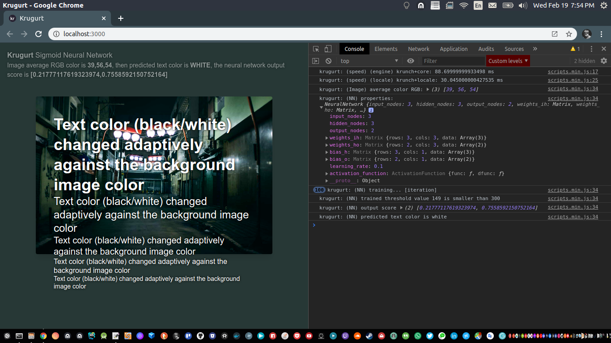
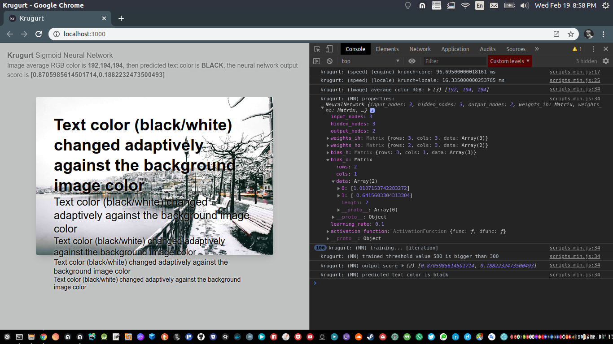
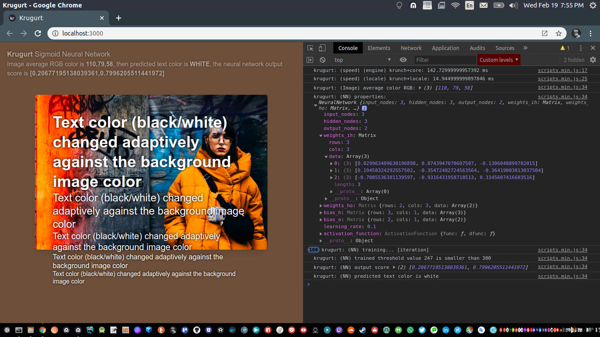
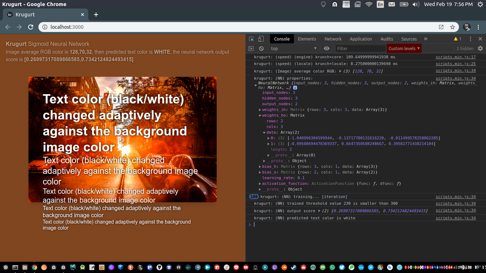

# krugurt-textcolor-neural-network

<p align="left">
  
  
  
  
  
  
  
  
  
  
  
  
</p>

<p align="left">
  
  
  
  
</p>

Change text color contrast against background image average color with machine learning on web browser with [krugurt.js](https://github.com/loouislow81/krugurt).


#### __network settings

- input layer ~ `3` (R,G,B).
- hidden layer ~ `3`
- output layer ~ `2` (isWhite, isBlack).
- activation function ~ `Sigmoid`.
- learning rate ~ `0.1`.
- iteration ~ `100`.

#### __samples

**(Note:)** `trainer` includes with nn settings and other DOM manipulations are located in `/src/assets/js/components/train.js`.

use the included sample image files for testing in `/src/views/index.html`,

```html
...

<!--samples-->

<!--pexels-photo-3597111.jpeg-->
<!--pexels-photo-3619784.jpeg-->
<!--pexels-photo-3631430.jpeg-->
<!--pexels-photo-3312671.jpeg-->
<!--pexels-photo-3473492.jpeg-->

...

  

...
```

#### __watch

to run the playground,

```bash
$ npm run watch
```

---

[MIT](https://github.com/loouislow81/krugurt-textcolor-neural-network/blob/master/LICENSE)
